# Codemap (auto-generated)

> Generated by `node scripts/build-codemap.js`. Do not hand-edit — edit the script, then regenerate.
> src/ relations are a heuristic (shared-global-scope symbol usage); service-relay/ relations are real `require()` edges.

## manifest.json — content script wiring

| # | matches | exclude | world | run_at | files (load order) |
|---|---|---|---|---|---|
| 0 | https://www.tradetech.net/*, https://mergeimagesonline.com/* | - | ISOLATED | document_idle | src/utils/date.js → src/utils/button.js → src/utils/relay-socket-client.js → src/utils/toolbar.js → src/utils/toolbar-relay.js → src/utils/banner.js → src/utils/dom.js → src/utils/voyage.js → src/utils/vessel-row.js → src/utils/port-row.js → src/utils/custom-rules.js → src/core/boundary.js → src/features/notes.js → src/features/notes-sidebar.js → src/features/tradetech-stars.js → src/features/validation.js → src/features/save-confirmation.js → src/features/date-syncing.js → src/features/manual-etd-highlight.js → src/features/arrival-depart-order-check.js → src/features/port-date-order-check.js → src/features/insert-port.js → src/features/port-name-reminder.js → src/features/vessel-name-reminder.js → src/features/port-highlighting.js → src/features/awr-flag.js → src/features/last-foreign-port-check.js → src/features/duplicate-vessel.js → src/features/duplicate-vessel-check.js → src/features/fix-vessel-dates.js → src/features/custom-rules-settings.js → src/features/vessel-no-date.js → src/features/port-no-date.js → src/features/vessel-to-be-announced.js → src/features/voyage-direction.js → src/features/resize-toggle.js → src/features/service-relay-send-relay.js → src/features/schedule-capture-relay.js → src/features/schedule-cascade.js → src/features/vessel-recommendation.js → src/features/rearrange-vessels.js → src/features/merge-download-signal-relay.js → src/features/upload-proof-relay.js → src/features/keyboard-navigation.js → src/features/select-field-on-focus.js → src/features/auto-nav-schedules.js → src/features/due-service-scanner-relay.js → src/features/awr-audit-relay.js → src/features/rotation-receipt-capture-relay.js → src/features/schedule-preview-tools-relay.js → src/features/date-step-buttons.js → src/features/voyage-step-buttons.js → src/features/date-calculator.js → src/features/live-check.js → src/features/live-check-relay.js → src/main.js |
| 1 | https://www.yangming.com/* | - | ISOLATED | document_idle | src/features/schedule-table-scrape-relay.js |
| 2 | <all_urls> | https://www.tradetech.net/* | ISOLATED | document_idle | src/utils/button.js → src/features/rename-toggle-relay.js → src/rename-toggle-init-relay.js |
| 3 | <all_urls> | https://www.tradetech.net/* | MAIN | document_start | src/features/force-tab-links.js |
| 4 | <all_urls> | - | ISOLATED | document_idle | src/features/highlighter.js |

## src/ — global-symbol relations (heuristic)

Content scripts share one global scope (no ES modules). An edge means the target file references a top-level symbol the source file defines.

```mermaid
flowchart LR
  background_relay_js["background-relay.js"] --> features_merge_download_signal_relay_js["features/merge-download-signal-relay.js"]
  background_relay_js["background-relay.js"] --> features_rename_toggle_relay_js["features/rename-toggle-relay.js"]
  background_relay_js["background-relay.js"] --> features_schedule_capture_relay_js["features/schedule-capture-relay.js"]
  background_relay_js["background-relay.js"] --> features_service_relay_send_relay_js["features/service-relay-send-relay.js"]
  background_relay_js["background-relay.js"] --> utils_relay_socket_client_js["utils/relay-socket-client.js"]
  background_relay_js["background-relay.js"] --> background_js["background.js"]
  background_js["background.js"] --> background_relay_js["background-relay.js"]
  core_boundary_js["core/boundary.js"] --> features_date_syncing_js["features/date-syncing.js"]
  core_boundary_js["core/boundary.js"] --> features_manual_etd_highlight_js["features/manual-etd-highlight.js"]
  core_boundary_js["core/boundary.js"] --> features_port_highlighting_js["features/port-highlighting.js"]
  features_arrival_depart_order_check_js["features/arrival-depart-order-check.js"] --> features_insert_port_js["features/insert-port.js"]
  features_arrival_depart_order_check_js["features/arrival-depart-order-check.js"] --> main_js["main.js"]
  features_auto_nav_schedules_js["features/auto-nav-schedules.js"] --> features_due_service_scanner_relay_js["features/due-service-scanner-relay.js"]
  features_auto_nav_schedules_js["features/auto-nav-schedules.js"] --> main_js["main.js"]
  features_awr_audit_relay_js["features/awr-audit-relay.js"] --> background_relay_js["background-relay.js"]
  features_awr_audit_relay_js["features/awr-audit-relay.js"] --> core_boundary_js["core/boundary.js"]
  features_awr_audit_relay_js["features/awr-audit-relay.js"] --> features_awr_flag_js["features/awr-flag.js"]
  features_awr_audit_relay_js["features/awr-audit-relay.js"] --> features_date_calculator_js["features/date-calculator.js"]
  features_awr_audit_relay_js["features/awr-audit-relay.js"] --> features_keyboard_navigation_js["features/keyboard-navigation.js"]
  features_awr_audit_relay_js["features/awr-audit-relay.js"] --> features_live_check_relay_js["features/live-check-relay.js"]
  features_awr_audit_relay_js["features/awr-audit-relay.js"] --> features_notes_sidebar_js["features/notes-sidebar.js"]
  features_awr_audit_relay_js["features/awr-audit-relay.js"] --> features_port_name_reminder_js["features/port-name-reminder.js"]
  features_awr_audit_relay_js["features/awr-audit-relay.js"] --> features_rename_toggle_relay_js["features/rename-toggle-relay.js"]
  features_awr_audit_relay_js["features/awr-audit-relay.js"] --> features_rotation_receipt_capture_relay_js["features/rotation-receipt-capture-relay.js"]
  features_awr_audit_relay_js["features/awr-audit-relay.js"] --> features_save_confirmation_js["features/save-confirmation.js"]
  features_awr_audit_relay_js["features/awr-audit-relay.js"] --> features_schedule_preview_tools_relay_js["features/schedule-preview-tools-relay.js"]
  features_awr_audit_relay_js["features/awr-audit-relay.js"] --> features_tradetech_stars_js["features/tradetech-stars.js"]
  features_awr_audit_relay_js["features/awr-audit-relay.js"] --> features_upload_proof_relay_js["features/upload-proof-relay.js"]
  features_awr_audit_relay_js["features/awr-audit-relay.js"] --> features_vessel_name_reminder_js["features/vessel-name-reminder.js"]
  features_awr_audit_relay_js["features/awr-audit-relay.js"] --> features_vessel_recommendation_js["features/vessel-recommendation.js"]
  features_awr_audit_relay_js["features/awr-audit-relay.js"] --> features_voyage_direction_js["features/voyage-direction.js"]
  features_awr_audit_relay_js["features/awr-audit-relay.js"] --> utils_banner_js["utils/banner.js"]
  features_awr_audit_relay_js["features/awr-audit-relay.js"] --> utils_button_js["utils/button.js"]
  features_awr_audit_relay_js["features/awr-audit-relay.js"] --> utils_toolbar_js["utils/toolbar.js"]
  features_awr_audit_relay_js["features/awr-audit-relay.js"] --> features_custom_rules_settings_js["features/custom-rules-settings.js"]
  features_awr_audit_relay_js["features/awr-audit-relay.js"] --> main_js["main.js"]
  features_awr_flag_js["features/awr-flag.js"] --> background_relay_js["background-relay.js"]
  features_awr_flag_js["features/awr-flag.js"] --> main_js["main.js"]
  features_custom_rules_settings_js["features/custom-rules-settings.js"] --> main_js["main.js"]
  features_date_calculator_js["features/date-calculator.js"] --> main_js["main.js"]
  features_date_step_buttons_js["features/date-step-buttons.js"] --> features_date_calculator_js["features/date-calculator.js"]
  features_date_step_buttons_js["features/date-step-buttons.js"] --> features_schedule_cascade_js["features/schedule-cascade.js"]
  features_date_step_buttons_js["features/date-step-buttons.js"] --> main_js["main.js"]
  features_date_syncing_js["features/date-syncing.js"] --> main_js["main.js"]
  features_due_service_scanner_relay_js["features/due-service-scanner-relay.js"] --> main_js["main.js"]
  features_duplicate_vessel_check_js["features/duplicate-vessel-check.js"] --> features_custom_rules_settings_js["features/custom-rules-settings.js"]
  features_duplicate_vessel_check_js["features/duplicate-vessel-check.js"] --> main_js["main.js"]
  features_duplicate_vessel_js["features/duplicate-vessel.js"] --> features_duplicate_vessel_check_js["features/duplicate-vessel-check.js"]
  features_duplicate_vessel_js["features/duplicate-vessel.js"] --> features_live_check_js["features/live-check.js"]
  features_duplicate_vessel_js["features/duplicate-vessel.js"] --> features_insert_port_js["features/insert-port.js"]
  features_duplicate_vessel_js["features/duplicate-vessel.js"] --> main_js["main.js"]
  features_fix_vessel_dates_js["features/fix-vessel-dates.js"] --> features_custom_rules_settings_js["features/custom-rules-settings.js"]
  features_fix_vessel_dates_js["features/fix-vessel-dates.js"] --> main_js["main.js"]
  features_force_tab_links_js["features/force-tab-links.js"] --> background_relay_js["background-relay.js"]
  features_force_tab_links_js["features/force-tab-links.js"] --> features_duplicate_vessel_check_js["features/duplicate-vessel-check.js"]
  features_force_tab_links_js["features/force-tab-links.js"] --> features_full_page_capture_inject_js["features/full-page-capture-inject.js"]
  features_force_tab_links_js["features/force-tab-links.js"] --> features_keyboard_navigation_js["features/keyboard-navigation.js"]
  features_force_tab_links_js["features/force-tab-links.js"] --> features_rename_toggle_relay_js["features/rename-toggle-relay.js"]
  features_force_tab_links_js["features/force-tab-links.js"] --> features_schedule_preview_tools_relay_js["features/schedule-preview-tools-relay.js"]
  features_force_tab_links_js["features/force-tab-links.js"] --> features_schedule_table_scrape_relay_js["features/schedule-table-scrape-relay.js"]
  features_force_tab_links_js["features/force-tab-links.js"] --> features_service_relay_send_relay_js["features/service-relay-send-relay.js"]
  features_force_tab_links_js["features/force-tab-links.js"] --> features_upload_proof_relay_js["features/upload-proof-relay.js"]
  features_force_tab_links_js["features/force-tab-links.js"] --> utils_relay_socket_client_js["utils/relay-socket-client.js"]
  features_highlighter_js["features/highlighter.js"] --> features_live_check_relay_js["features/live-check-relay.js"]
  features_insert_port_js["features/insert-port.js"] --> features_port_name_reminder_js["features/port-name-reminder.js"]
  features_insert_port_js["features/insert-port.js"] --> features_save_confirmation_js["features/save-confirmation.js"]
  features_insert_port_js["features/insert-port.js"] --> main_js["main.js"]
  features_keyboard_navigation_js["features/keyboard-navigation.js"] --> main_js["main.js"]
  features_last_foreign_port_check_js["features/last-foreign-port-check.js"] --> main_js["main.js"]
  features_live_check_js["features/live-check.js"] --> features_custom_rules_settings_js["features/custom-rules-settings.js"]
  features_live_check_js["features/live-check.js"] --> features_live_check_relay_js["features/live-check-relay.js"]
  features_live_check_js["features/live-check.js"] --> main_js["main.js"]
  features_manual_etd_highlight_js["features/manual-etd-highlight.js"] --> main_js["main.js"]
  features_merge_download_signal_relay_js["features/merge-download-signal-relay.js"] --> main_js["main.js"]
  features_notes_sidebar_js["features/notes-sidebar.js"] --> features_notes_js["features/notes.js"]
  features_notes_sidebar_js["features/notes-sidebar.js"] --> main_js["main.js"]
  features_notes_js["features/notes.js"] --> features_notes_sidebar_js["features/notes-sidebar.js"]
  features_notes_js["features/notes.js"] --> main_js["main.js"]
  features_port_date_order_check_js["features/port-date-order-check.js"] --> main_js["main.js"]
  features_port_highlighting_js["features/port-highlighting.js"] --> background_relay_js["background-relay.js"]
  features_port_highlighting_js["features/port-highlighting.js"] --> features_insert_port_js["features/insert-port.js"]
  features_port_highlighting_js["features/port-highlighting.js"] --> features_port_no_date_js["features/port-no-date.js"]
  features_port_highlighting_js["features/port-highlighting.js"] --> features_save_confirmation_js["features/save-confirmation.js"]
  features_port_highlighting_js["features/port-highlighting.js"] --> features_schedule_cascade_js["features/schedule-cascade.js"]
  features_port_highlighting_js["features/port-highlighting.js"] --> features_vessel_recommendation_js["features/vessel-recommendation.js"]
  features_port_highlighting_js["features/port-highlighting.js"] --> main_js["main.js"]
  features_port_name_reminder_js["features/port-name-reminder.js"] --> main_js["main.js"]
  features_port_no_date_js["features/port-no-date.js"] --> features_insert_port_js["features/insert-port.js"]
  features_port_no_date_js["features/port-no-date.js"] --> features_port_highlighting_js["features/port-highlighting.js"]
  features_port_no_date_js["features/port-no-date.js"] --> main_js["main.js"]
  features_rearrange_vessels_js["features/rearrange-vessels.js"] --> features_schedule_capture_relay_js["features/schedule-capture-relay.js"]
  features_rearrange_vessels_js["features/rearrange-vessels.js"] --> main_js["main.js"]
  features_rename_toggle_relay_js["features/rename-toggle-relay.js"] --> rename_toggle_init_relay_js["rename-toggle-init-relay.js"]
  features_resize_toggle_js["features/resize-toggle.js"] --> main_js["main.js"]
  features_rotation_receipt_capture_relay_js["features/rotation-receipt-capture-relay.js"] --> background_relay_js["background-relay.js"]
  features_rotation_receipt_capture_relay_js["features/rotation-receipt-capture-relay.js"] --> core_boundary_js["core/boundary.js"]
  features_rotation_receipt_capture_relay_js["features/rotation-receipt-capture-relay.js"] --> features_awr_audit_relay_js["features/awr-audit-relay.js"]
  features_rotation_receipt_capture_relay_js["features/rotation-receipt-capture-relay.js"] --> features_awr_flag_js["features/awr-flag.js"]
  features_rotation_receipt_capture_relay_js["features/rotation-receipt-capture-relay.js"] --> features_date_calculator_js["features/date-calculator.js"]
  features_rotation_receipt_capture_relay_js["features/rotation-receipt-capture-relay.js"] --> features_keyboard_navigation_js["features/keyboard-navigation.js"]
  features_rotation_receipt_capture_relay_js["features/rotation-receipt-capture-relay.js"] --> features_live_check_relay_js["features/live-check-relay.js"]
  features_rotation_receipt_capture_relay_js["features/rotation-receipt-capture-relay.js"] --> features_notes_sidebar_js["features/notes-sidebar.js"]
  features_rotation_receipt_capture_relay_js["features/rotation-receipt-capture-relay.js"] --> features_port_name_reminder_js["features/port-name-reminder.js"]
  features_rotation_receipt_capture_relay_js["features/rotation-receipt-capture-relay.js"] --> features_rename_toggle_relay_js["features/rename-toggle-relay.js"]
  features_rotation_receipt_capture_relay_js["features/rotation-receipt-capture-relay.js"] --> features_save_confirmation_js["features/save-confirmation.js"]
  features_rotation_receipt_capture_relay_js["features/rotation-receipt-capture-relay.js"] --> features_schedule_preview_tools_relay_js["features/schedule-preview-tools-relay.js"]
  features_rotation_receipt_capture_relay_js["features/rotation-receipt-capture-relay.js"] --> features_tradetech_stars_js["features/tradetech-stars.js"]
  features_rotation_receipt_capture_relay_js["features/rotation-receipt-capture-relay.js"] --> features_upload_proof_relay_js["features/upload-proof-relay.js"]
  features_rotation_receipt_capture_relay_js["features/rotation-receipt-capture-relay.js"] --> features_vessel_name_reminder_js["features/vessel-name-reminder.js"]
  features_rotation_receipt_capture_relay_js["features/rotation-receipt-capture-relay.js"] --> features_vessel_recommendation_js["features/vessel-recommendation.js"]
  features_rotation_receipt_capture_relay_js["features/rotation-receipt-capture-relay.js"] --> features_voyage_direction_js["features/voyage-direction.js"]
  features_rotation_receipt_capture_relay_js["features/rotation-receipt-capture-relay.js"] --> utils_banner_js["utils/banner.js"]
  features_rotation_receipt_capture_relay_js["features/rotation-receipt-capture-relay.js"] --> utils_button_js["utils/button.js"]
  features_rotation_receipt_capture_relay_js["features/rotation-receipt-capture-relay.js"] --> utils_toolbar_js["utils/toolbar.js"]
  features_rotation_receipt_capture_relay_js["features/rotation-receipt-capture-relay.js"] --> features_custom_rules_settings_js["features/custom-rules-settings.js"]
  features_rotation_receipt_capture_relay_js["features/rotation-receipt-capture-relay.js"] --> main_js["main.js"]
  features_save_confirmation_js["features/save-confirmation.js"] --> background_relay_js["background-relay.js"]
  features_save_confirmation_js["features/save-confirmation.js"] --> features_rotation_receipt_capture_relay_js["features/rotation-receipt-capture-relay.js"]
  features_save_confirmation_js["features/save-confirmation.js"] --> main_js["main.js"]
  features_schedule_capture_relay_js["features/schedule-capture-relay.js"] --> main_js["main.js"]
  features_schedule_cascade_js["features/schedule-cascade.js"] --> features_date_step_buttons_js["features/date-step-buttons.js"]
  features_schedule_cascade_js["features/schedule-cascade.js"] --> features_vessel_recommendation_js["features/vessel-recommendation.js"]
  features_schedule_cascade_js["features/schedule-cascade.js"] --> main_js["main.js"]
  features_schedule_preview_tools_relay_js["features/schedule-preview-tools-relay.js"] --> main_js["main.js"]
  features_select_field_on_focus_js["features/select-field-on-focus.js"] --> main_js["main.js"]
  features_service_relay_send_relay_js["features/service-relay-send-relay.js"] --> main_js["main.js"]
  features_tradetech_stars_js["features/tradetech-stars.js"] --> main_js["main.js"]
  features_upload_proof_relay_js["features/upload-proof-relay.js"] --> features_custom_rules_settings_js["features/custom-rules-settings.js"]
  features_upload_proof_relay_js["features/upload-proof-relay.js"] --> features_schedule_table_scrape_relay_js["features/schedule-table-scrape-relay.js"]
  features_upload_proof_relay_js["features/upload-proof-relay.js"] --> main_js["main.js"]
  features_validation_js["features/validation.js"] --> features_date_syncing_js["features/date-syncing.js"]
  features_validation_js["features/validation.js"] --> features_duplicate_vessel_js["features/duplicate-vessel.js"]
  features_validation_js["features/validation.js"] --> features_live_check_relay_js["features/live-check-relay.js"]
  features_validation_js["features/validation.js"] --> features_save_confirmation_js["features/save-confirmation.js"]
  features_validation_js["features/validation.js"] --> main_js["main.js"]
  features_vessel_name_reminder_js["features/vessel-name-reminder.js"] --> main_js["main.js"]
  features_vessel_no_date_js["features/vessel-no-date.js"] --> features_duplicate_vessel_js["features/duplicate-vessel.js"]
  features_vessel_no_date_js["features/vessel-no-date.js"] --> main_js["main.js"]
  features_vessel_recommendation_js["features/vessel-recommendation.js"] --> features_duplicate_vessel_js["features/duplicate-vessel.js"]
  features_vessel_recommendation_js["features/vessel-recommendation.js"] --> features_schedule_cascade_js["features/schedule-cascade.js"]
  features_vessel_recommendation_js["features/vessel-recommendation.js"] --> main_js["main.js"]
  features_vessel_to_be_announced_js["features/vessel-to-be-announced.js"] --> main_js["main.js"]
  features_voyage_direction_js["features/voyage-direction.js"] --> main_js["main.js"]
  features_voyage_step_buttons_js["features/voyage-step-buttons.js"] --> main_js["main.js"]
  main_js["main.js"] --> features_date_step_buttons_js["features/date-step-buttons.js"]
  main_js["main.js"] --> features_fix_vessel_dates_js["features/fix-vessel-dates.js"]
  main_js["main.js"] --> features_insert_port_js["features/insert-port.js"]
  main_js["main.js"] --> features_live_check_js["features/live-check.js"]
  main_js["main.js"] --> features_schedule_cascade_js["features/schedule-cascade.js"]
  main_js["main.js"] --> features_duplicate_vessel_js["features/duplicate-vessel.js"]
  main_js["main.js"] --> features_keyboard_navigation_js["features/keyboard-navigation.js"]
  main_js["main.js"] --> features_port_highlighting_js["features/port-highlighting.js"]
  main_js["main.js"] --> features_voyage_step_buttons_js["features/voyage-step-buttons.js"]
  utils_banner_js["utils/banner.js"] --> features_schedule_cascade_js["features/schedule-cascade.js"]
  utils_banner_js["utils/banner.js"] --> features_upload_proof_relay_js["features/upload-proof-relay.js"]
  utils_banner_js["utils/banner.js"] --> features_validation_js["features/validation.js"]
  utils_banner_js["utils/banner.js"] --> features_vessel_recommendation_js["features/vessel-recommendation.js"]
  utils_banner_js["utils/banner.js"] --> features_awr_audit_relay_js["features/awr-audit-relay.js"]
  utils_banner_js["utils/banner.js"] --> features_awr_flag_js["features/awr-flag.js"]
  utils_banner_js["utils/banner.js"] --> features_duplicate_vessel_js["features/duplicate-vessel.js"]
  utils_banner_js["utils/banner.js"] --> features_insert_port_js["features/insert-port.js"]
  utils_banner_js["utils/banner.js"] --> features_live_check_js["features/live-check.js"]
  utils_banner_js["utils/banner.js"] --> features_rearrange_vessels_js["features/rearrange-vessels.js"]
  utils_banner_js["utils/banner.js"] --> features_rotation_receipt_capture_relay_js["features/rotation-receipt-capture-relay.js"]
  utils_banner_js["utils/banner.js"] --> utils_toolbar_js["utils/toolbar.js"]
  utils_banner_js["utils/banner.js"] --> features_notes_sidebar_js["features/notes-sidebar.js"]
  utils_banner_js["utils/banner.js"] --> features_arrival_depart_order_check_js["features/arrival-depart-order-check.js"]
  utils_banner_js["utils/banner.js"] --> features_duplicate_vessel_check_js["features/duplicate-vessel-check.js"]
  utils_banner_js["utils/banner.js"] --> features_last_foreign_port_check_js["features/last-foreign-port-check.js"]
  utils_banner_js["utils/banner.js"] --> features_port_date_order_check_js["features/port-date-order-check.js"]
  utils_banner_js["utils/banner.js"] --> features_port_no_date_js["features/port-no-date.js"]
  utils_banner_js["utils/banner.js"] --> features_vessel_no_date_js["features/vessel-no-date.js"]
  utils_banner_js["utils/banner.js"] --> features_custom_rules_settings_js["features/custom-rules-settings.js"]
  utils_button_js["utils/button.js"] --> features_rename_toggle_relay_js["features/rename-toggle-relay.js"]
  utils_button_js["utils/button.js"] --> utils_toolbar_js["utils/toolbar.js"]
  utils_custom_rules_js["utils/custom-rules.js"] --> features_awr_audit_relay_js["features/awr-audit-relay.js"]
  utils_custom_rules_js["utils/custom-rules.js"] --> features_custom_rules_settings_js["features/custom-rules-settings.js"]
  utils_custom_rules_js["utils/custom-rules.js"] --> features_fix_vessel_dates_js["features/fix-vessel-dates.js"]
  utils_custom_rules_js["utils/custom-rules.js"] --> features_highlighter_js["features/highlighter.js"]
  utils_custom_rules_js["utils/custom-rules.js"] --> features_keyboard_navigation_js["features/keyboard-navigation.js"]
  utils_custom_rules_js["utils/custom-rules.js"] --> features_live_check_js["features/live-check.js"]
  utils_custom_rules_js["utils/custom-rules.js"] --> features_notes_js["features/notes.js"]
  utils_custom_rules_js["utils/custom-rules.js"] --> features_rotation_receipt_capture_relay_js["features/rotation-receipt-capture-relay.js"]
  utils_custom_rules_js["utils/custom-rules.js"] --> features_save_confirmation_js["features/save-confirmation.js"]
  utils_custom_rules_js["utils/custom-rules.js"] --> features_validation_js["features/validation.js"]
  utils_custom_rules_js["utils/custom-rules.js"] --> utils_banner_js["utils/banner.js"]
  utils_date_js["utils/date.js"] --> features_arrival_depart_order_check_js["features/arrival-depart-order-check.js"]
  utils_date_js["utils/date.js"] --> features_date_calculator_js["features/date-calculator.js"]
  utils_date_js["utils/date.js"] --> features_date_step_buttons_js["features/date-step-buttons.js"]
  utils_date_js["utils/date.js"] --> features_fix_vessel_dates_js["features/fix-vessel-dates.js"]
  utils_date_js["utils/date.js"] --> features_live_check_relay_js["features/live-check-relay.js"]
  utils_date_js["utils/date.js"] --> features_notes_js["features/notes.js"]
  utils_date_js["utils/date.js"] --> features_port_date_order_check_js["features/port-date-order-check.js"]
  utils_date_js["utils/date.js"] --> features_rearrange_vessels_js["features/rearrange-vessels.js"]
  utils_date_js["utils/date.js"] --> features_save_confirmation_js["features/save-confirmation.js"]
  utils_date_js["utils/date.js"] --> features_schedule_cascade_js["features/schedule-cascade.js"]
  utils_date_js["utils/date.js"] --> features_validation_js["features/validation.js"]
  utils_date_js["utils/date.js"] --> features_vessel_recommendation_js["features/vessel-recommendation.js"]
  utils_dom_js["utils/dom.js"] --> features_date_step_buttons_js["features/date-step-buttons.js"]
  utils_dom_js["utils/dom.js"] --> features_date_syncing_js["features/date-syncing.js"]
  utils_dom_js["utils/dom.js"] --> features_duplicate_vessel_js["features/duplicate-vessel.js"]
  utils_dom_js["utils/dom.js"] --> features_fix_vessel_dates_js["features/fix-vessel-dates.js"]
  utils_dom_js["utils/dom.js"] --> features_insert_port_js["features/insert-port.js"]
  utils_dom_js["utils/dom.js"] --> features_live_check_relay_js["features/live-check-relay.js"]
  utils_dom_js["utils/dom.js"] --> features_live_check_js["features/live-check.js"]
  utils_dom_js["utils/dom.js"] --> features_notes_sidebar_js["features/notes-sidebar.js"]
  utils_dom_js["utils/dom.js"] --> features_notes_js["features/notes.js"]
  utils_dom_js["utils/dom.js"] --> features_save_confirmation_js["features/save-confirmation.js"]
  utils_dom_js["utils/dom.js"] --> features_schedule_cascade_js["features/schedule-cascade.js"]
  utils_dom_js["utils/dom.js"] --> features_vessel_to_be_announced_js["features/vessel-to-be-announced.js"]
  utils_dom_js["utils/dom.js"] --> features_voyage_direction_js["features/voyage-direction.js"]
  utils_dom_js["utils/dom.js"] --> features_voyage_step_buttons_js["features/voyage-step-buttons.js"]
  utils_dom_js["utils/dom.js"] --> utils_port_row_js["utils/port-row.js"]
  utils_dom_js["utils/dom.js"] --> utils_vessel_row_js["utils/vessel-row.js"]
  utils_dom_js["utils/dom.js"] --> features_keyboard_navigation_js["features/keyboard-navigation.js"]
  utils_dom_js["utils/dom.js"] --> features_select_field_on_focus_js["features/select-field-on-focus.js"]
  utils_port_row_js["utils/port-row.js"] --> features_insert_port_js["features/insert-port.js"]
  utils_port_row_js["utils/port-row.js"] --> features_port_no_date_js["features/port-no-date.js"]
  utils_port_row_js["utils/port-row.js"] --> features_schedule_capture_relay_js["features/schedule-capture-relay.js"]
  utils_relay_socket_client_js["utils/relay-socket-client.js"] --> features_due_service_scanner_relay_js["features/due-service-scanner-relay.js"]
  utils_relay_socket_client_js["utils/relay-socket-client.js"] --> features_live_check_relay_js["features/live-check-relay.js"]
  utils_relay_socket_client_js["utils/relay-socket-client.js"] --> features_schedule_preview_tools_relay_js["features/schedule-preview-tools-relay.js"]
  utils_relay_socket_client_js["utils/relay-socket-client.js"] --> features_upload_proof_relay_js["features/upload-proof-relay.js"]
  utils_relay_socket_client_js["utils/relay-socket-client.js"] --> utils_toolbar_relay_js["utils/toolbar-relay.js"]
  utils_relay_socket_client_js["utils/relay-socket-client.js"] --> background_relay_js["background-relay.js"]
  utils_relay_socket_client_js["utils/relay-socket-client.js"] --> features_merge_download_signal_relay_js["features/merge-download-signal-relay.js"]
  utils_relay_socket_client_js["utils/relay-socket-client.js"] --> features_schedule_capture_relay_js["features/schedule-capture-relay.js"]
  utils_relay_socket_client_js["utils/relay-socket-client.js"] --> features_service_relay_send_relay_js["features/service-relay-send-relay.js"]
  utils_toolbar_js["utils/toolbar.js"] --> features_awr_audit_relay_js["features/awr-audit-relay.js"]
  utils_toolbar_js["utils/toolbar.js"] --> features_awr_flag_js["features/awr-flag.js"]
  utils_toolbar_js["utils/toolbar.js"] --> features_date_calculator_js["features/date-calculator.js"]
  utils_toolbar_js["utils/toolbar.js"] --> features_duplicate_vessel_js["features/duplicate-vessel.js"]
  utils_toolbar_js["utils/toolbar.js"] --> features_insert_port_js["features/insert-port.js"]
  utils_toolbar_js["utils/toolbar.js"] --> features_rearrange_vessels_js["features/rearrange-vessels.js"]
  utils_toolbar_js["utils/toolbar.js"] --> features_schedule_cascade_js["features/schedule-cascade.js"]
  utils_toolbar_js["utils/toolbar.js"] --> features_voyage_direction_js["features/voyage-direction.js"]
  utils_toolbar_js["utils/toolbar.js"] --> utils_banner_js["utils/banner.js"]
  utils_toolbar_js["utils/toolbar.js"] --> features_due_service_scanner_relay_js["features/due-service-scanner-relay.js"]
  utils_toolbar_js["utils/toolbar.js"] --> features_live_check_relay_js["features/live-check-relay.js"]
  utils_toolbar_js["utils/toolbar.js"] --> features_notes_sidebar_js["features/notes-sidebar.js"]
  utils_toolbar_js["utils/toolbar.js"] --> features_rotation_receipt_capture_relay_js["features/rotation-receipt-capture-relay.js"]
  utils_toolbar_js["utils/toolbar.js"] --> features_schedule_preview_tools_relay_js["features/schedule-preview-tools-relay.js"]
  utils_toolbar_js["utils/toolbar.js"] --> features_upload_proof_relay_js["features/upload-proof-relay.js"]
  utils_toolbar_js["utils/toolbar.js"] --> utils_custom_rules_js["utils/custom-rules.js"]
  utils_toolbar_js["utils/toolbar.js"] --> utils_toolbar_relay_js["utils/toolbar-relay.js"]
  utils_vessel_row_js["utils/vessel-row.js"] --> features_duplicate_vessel_js["features/duplicate-vessel.js"]
  utils_vessel_row_js["utils/vessel-row.js"] --> features_live_check_relay_js["features/live-check-relay.js"]
  utils_vessel_row_js["utils/vessel-row.js"] --> features_schedule_capture_relay_js["features/schedule-capture-relay.js"]
  utils_vessel_row_js["utils/vessel-row.js"] --> features_validation_js["features/validation.js"]
  utils_vessel_row_js["utils/vessel-row.js"] --> features_vessel_no_date_js["features/vessel-no-date.js"]
  utils_vessel_row_js["utils/vessel-row.js"] --> features_vessel_recommendation_js["features/vessel-recommendation.js"]
  utils_voyage_js["utils/voyage.js"] --> features_duplicate_vessel_js["features/duplicate-vessel.js"]
  utils_voyage_js["utils/voyage.js"] --> features_fix_vessel_dates_js["features/fix-vessel-dates.js"]
  utils_voyage_js["utils/voyage.js"] --> features_live_check_js["features/live-check.js"]
  utils_voyage_js["utils/voyage.js"] --> features_voyage_step_buttons_js["features/voyage-step-buttons.js"]
```

| file | defines | used by |
|---|---|---|
| background-relay.js | renamingEnabled, ws, relayAvailable, pendingRenamingSend, awaitingRenamingEcho, batchJobRunning, connectWebSocket, broadcastRenameState, isRecognizedSchedulePage, AWR_AUDIT_SETTLE_MS, AWR_AUDIT_THROTTLE_MS, sleep, waitForTabComplete, RECEIPT_CAPTURE_SETTLE_MS, RECEIPT_CAPTURE_THROTTLE_MS, AWR_DATE_RESTORE_RECORDS, ddMmmYyyyToMmDdYy, setRelayAvailable | features/merge-download-signal-relay.js, features/rename-toggle-relay.js, features/schedule-capture-relay.js, features/service-relay-send-relay.js, utils/relay-socket-client.js, background.js |
| background.js | fpcExtraCaptures, FPC_MAX_DIMENSION, FPC_MAX_AREA, FPC_SLICE_DELAY_MS, fpcInProgress, sendToTab, sleep, reportCaptureError | background-relay.js |
| core/boundary.js | PortSyncBoundary | features/date-syncing.js, features/manual-etd-highlight.js, features/port-highlighting.js |
| features/arrival-depart-order-check.js | ArrivalDepartOrderCheck | features/insert-port.js, main.js |
| features/auto-nav-schedules.js | AutoNavSchedules | features/due-service-scanner-relay.js, main.js |
| features/awr-audit-relay.js | top, AwrAudit | background-relay.js, core/boundary.js, features/awr-flag.js, features/date-calculator.js, features/keyboard-navigation.js, features/live-check-relay.js, features/notes-sidebar.js, features/port-name-reminder.js, features/rename-toggle-relay.js, features/rotation-receipt-capture-relay.js, features/save-confirmation.js, features/schedule-preview-tools-relay.js, features/tradetech-stars.js, features/upload-proof-relay.js, features/vessel-name-reminder.js, features/vessel-recommendation.js, features/voyage-direction.js, utils/banner.js, utils/button.js, utils/toolbar.js, features/custom-rules-settings.js, main.js |
| features/awr-flag.js | AwrFlag | background-relay.js, main.js |
| features/custom-rules-settings.js | CustomRulesSettings | main.js |
| features/date-calculator.js | DateCalculator | main.js |
| features/date-step-buttons.js | DateStepButtons | features/date-calculator.js, features/schedule-cascade.js, main.js |
| features/date-syncing.js | DateSyncing | main.js |
| features/due-service-scanner-relay.js | DueServiceScanner | main.js |
| features/duplicate-vessel-check.js | DuplicateVesselCheck | features/custom-rules-settings.js, main.js |
| features/duplicate-vessel.js | vesselCodeField, readVesselCode, writeVesselCode, VesselActionHistory, DuplicateVessel, DeleteVessel | features/duplicate-vessel-check.js, features/live-check.js, features/insert-port.js, main.js |
| features/fix-vessel-dates.js | FixVesselDates | features/custom-rules-settings.js, main.js |
| features/force-tab-links.js | open | background-relay.js, features/duplicate-vessel-check.js, features/full-page-capture-inject.js, features/keyboard-navigation.js, features/rename-toggle-relay.js, features/schedule-preview-tools-relay.js, features/schedule-table-scrape-relay.js, features/service-relay-send-relay.js, features/upload-proof-relay.js, utils/relay-socket-client.js |
| features/full-page-capture-inject.js | - | - |
| features/highlighter.js | CONTEXT_RADIUS, storageKey, loadHighlights, wrapRange, getTextNodesInRange, unwrap, captureContext, findRange, locate | features/live-check-relay.js |
| features/insert-port.js | portField, portDateField, readPortRow, writePortRow, blankPortRowValues, PortActionHistory, InsertPort, DeletePort | features/port-name-reminder.js, features/save-confirmation.js, main.js |
| features/keyboard-navigation.js | KeyboardFieldNav | main.js |
| features/last-foreign-port-check.js | LastForeignPortCheck | main.js |
| features/live-check-relay.js | LiveCheckRelay | - |
| features/live-check.js | LiveCheck | features/custom-rules-settings.js, features/live-check-relay.js, main.js |
| features/manual-etd-highlight.js | ManualEtdHighlight | main.js |
| features/merge-download-signal-relay.js | MergeDownloadSignal | main.js |
| features/notes-sidebar.js | NotesSidebar | features/notes.js, main.js |
| features/notes.js | NotesDateReplacement | features/notes-sidebar.js, main.js |
| features/port-date-order-check.js | PortDateOrderCheck | main.js |
| features/port-highlighting.js | PortHighlighting | background-relay.js, features/insert-port.js, features/port-no-date.js, features/save-confirmation.js, features/schedule-cascade.js, features/vessel-recommendation.js, main.js |
| features/port-name-reminder.js | PortNameReminder | main.js |
| features/port-no-date.js | DetectPortNoDate | features/insert-port.js, features/port-highlighting.js, main.js |
| features/rearrange-vessels.js | RearrangeVessels | features/schedule-capture-relay.js, main.js |
| features/rename-toggle-relay.js | RenameToggle | rename-toggle-init-relay.js |
| features/resize-toggle.js | ResizeToggleOff | main.js |
| features/rotation-receipt-capture-relay.js | top, RotationReceiptCapture | background-relay.js, core/boundary.js, features/awr-audit-relay.js, features/awr-flag.js, features/date-calculator.js, features/keyboard-navigation.js, features/live-check-relay.js, features/notes-sidebar.js, features/port-name-reminder.js, features/rename-toggle-relay.js, features/save-confirmation.js, features/schedule-preview-tools-relay.js, features/tradetech-stars.js, features/upload-proof-relay.js, features/vessel-name-reminder.js, features/vessel-recommendation.js, features/voyage-direction.js, utils/banner.js, utils/button.js, utils/toolbar.js, features/custom-rules-settings.js, main.js |
| features/save-confirmation.js | SaveConfirmation | background-relay.js, features/rotation-receipt-capture-relay.js, main.js |
| features/schedule-capture-relay.js | ScheduleCapture | main.js |
| features/schedule-cascade.js | ScheduleCascade | features/date-step-buttons.js, features/vessel-recommendation.js, main.js |
| features/schedule-preview-tools-relay.js | MARK_DONE_BUTTON_STYLE, createMarkDoneButton, SchedulePreviewTools | main.js |
| features/schedule-table-scrape-relay.js | ScheduleTableScrape | - |
| features/select-field-on-focus.js | SelectFieldOnFocus | main.js |
| features/service-relay-send-relay.js | ServiceRelaySend | main.js |
| features/tradetech-stars.js | TradetechStars | main.js |
| features/upload-proof-relay.js | UploadProof | features/custom-rules-settings.js, features/schedule-table-scrape-relay.js, main.js |
| features/validation.js | SP001DateValidation | features/date-syncing.js, features/duplicate-vessel.js, features/live-check-relay.js, features/save-confirmation.js, main.js |
| features/vessel-name-reminder.js | VesselNameReminder | main.js |
| features/vessel-no-date.js | DetectVesselNoDate | features/duplicate-vessel.js, main.js |
| features/vessel-recommendation.js | VesselRecommendation | features/duplicate-vessel.js, features/schedule-cascade.js, main.js |
| features/vessel-to-be-announced.js | VesselTBA | main.js |
| features/voyage-direction.js | VDirection | main.js |
| features/voyage-step-buttons.js | VoyageStepButtons | main.js |
| main.js | syncingDepth, beginSync, endSync, isSyncing, FEATURES, runFeature | features/date-step-buttons.js, features/fix-vessel-dates.js, features/insert-port.js, features/live-check.js, features/schedule-cascade.js, features/duplicate-vessel.js, features/keyboard-navigation.js, features/port-highlighting.js, features/voyage-step-buttons.js |
| rename-toggle-init-relay.js | - | - |
| utils/banner.js | activeWarnings, showBanner, removeBanner, SUCCESS_GAP, getStackedBannerTop, getSuccessBannerTop, repositionStackedBanners, buildSuccessStyle, successBannerTimer, removeSuccessBanner, buildInfoStyle, INFO_BANNER_TEXT_SHADOW, removeInfoBanner, setInfoBanner, getSuggestionBannerTop, buildSuggestionStyle, removeSuggestionBanner, setSuggestionBanner, showTemporaryBanner, BANNER_STYLE, setWarning, WARNING_KEY_ALWAYS_SHOW_RULE, shouldShowWarning, renderWarnings, showCombinedBanner, ALL_BANNER_IDS, HIDEABLE_BANNER_IDS, BANNER_ALWAYS_SHOW_RULE, notificationsHidden, applyNotificationVisibility, toggleNotificationVisibility, createNotificationToggle | features/schedule-cascade.js, features/upload-proof-relay.js, features/validation.js, features/vessel-recommendation.js, features/awr-audit-relay.js, features/awr-flag.js, features/duplicate-vessel.js, features/insert-port.js, features/live-check.js, features/rearrange-vessels.js, features/rotation-receipt-capture-relay.js, utils/toolbar.js, features/notes-sidebar.js, features/arrival-depart-order-check.js, features/duplicate-vessel-check.js, features/last-foreign-port-check.js, features/port-date-order-check.js, features/port-no-date.js, features/vessel-no-date.js, features/custom-rules-settings.js |
| utils/button.js | createButton, isDragging, didDrag, startX | features/rename-toggle-relay.js, utils/toolbar.js |
| utils/custom-rules.js | CustomRules | features/awr-audit-relay.js, features/custom-rules-settings.js, features/fix-vessel-dates.js, features/highlighter.js, features/keyboard-navigation.js, features/live-check.js, features/notes.js, features/rotation-receipt-capture-relay.js, features/save-confirmation.js, features/validation.js, utils/banner.js |
| utils/date.js | DateUtils | features/arrival-depart-order-check.js, features/date-calculator.js, features/date-step-buttons.js, features/fix-vessel-dates.js, features/live-check-relay.js, features/notes.js, features/port-date-order-check.js, features/rearrange-vessels.js, features/save-confirmation.js, features/schedule-cascade.js, features/validation.js, features/vessel-recommendation.js |
| utils/dom.js | setFieldValue, PORT_NAME_FIELD_PATTERN, selectFieldSmart, commitAllDateFields, mirrorPvShadow, waitForFieldValue, insertActionButtonAfter | features/date-step-buttons.js, features/date-syncing.js, features/duplicate-vessel.js, features/fix-vessel-dates.js, features/insert-port.js, features/live-check-relay.js, features/live-check.js, features/notes-sidebar.js, features/notes.js, features/save-confirmation.js, features/schedule-cascade.js, features/vessel-to-be-announced.js, features/voyage-direction.js, features/voyage-step-buttons.js, utils/port-row.js, utils/vessel-row.js, features/keyboard-navigation.js, features/select-field-on-focus.js |
| utils/port-row.js | PortRow | features/insert-port.js, features/port-no-date.js, features/schedule-capture-relay.js |
| utils/relay-socket-client.js | RelayConnectionStatus, onRelayConnectionStatusChange, isRelayConnected, connectRelaySocket | features/due-service-scanner-relay.js, features/live-check-relay.js, features/schedule-preview-tools-relay.js, features/upload-proof-relay.js, utils/toolbar-relay.js, background-relay.js, features/merge-download-signal-relay.js, features/schedule-capture-relay.js, features/service-relay-send-relay.js |
| utils/toolbar-relay.js | ToolbarRelay | - |
| utils/toolbar.js | isOnScheduleForm, Toolbar | features/awr-audit-relay.js, features/awr-flag.js, features/date-calculator.js, features/duplicate-vessel.js, features/insert-port.js, features/rearrange-vessels.js, features/schedule-cascade.js, features/voyage-direction.js, utils/banner.js, features/due-service-scanner-relay.js, features/live-check-relay.js, features/notes-sidebar.js, features/rotation-receipt-capture-relay.js, features/schedule-preview-tools-relay.js, features/upload-proof-relay.js, utils/custom-rules.js, utils/toolbar-relay.js |
| utils/vessel-row.js | VesselRow | features/duplicate-vessel.js, features/live-check-relay.js, features/schedule-capture-relay.js, features/validation.js, features/vessel-no-date.js, features/vessel-recommendation.js |
| utils/voyage.js | VoyageUtils | features/duplicate-vessel.js, features/fix-vessel-dates.js, features/live-check.js, features/voyage-step-buttons.js |

## service-relay/ — require() graph

```mermaid
flowchart LR
  activity_log_store_js["activity-log-store.js"] --> config_js["config.js"]
  activity_log_store_js["activity-log-store.js"] --> atomic_write_js["atomic-write.js"]
  build_result_js["build-result.js"] --> config_js["config.js"]
  build_result_js["build-result.js"] --> schedule_guideline_store_js["schedule-guideline-store.js"]
  build_result_js["build-result.js"] --> port_dictionary_js["port-dictionary.js"]
  config_js["config.js"] --> settings_store_js["settings-store.js"]
  current_batch_store_js["current-batch-store.js"] --> config_js["config.js"]
  current_batch_store_js["current-batch-store.js"] --> due_services_trim_js["due-services-trim.js"]
  current_batch_store_js["current-batch-store.js"] --> due_date_utils_js["due-date-utils.js"]
  current_batch_store_js["current-batch-store.js"] --> atomic_write_js["atomic-write.js"]
  download_watcher_js["download-watcher.js"] --> config_js["config.js"]
  download_watcher_js["download-watcher.js"] --> relay_state_js["relay-state.js"]
  download_watcher_js["download-watcher.js"] --> proof_extract_js["proof-extract.js"]
  download_watcher_js["download-watcher.js"] --> proof_parsers_yangming_html_js["proof-parsers/yangming-html.js"]
  download_watcher_js["download-watcher.js"] --> proof_parsers_evergreen_html_js["proof-parsers/evergreen-html.js"]
  download_watcher_js["download-watcher.js"] --> schedule_dom_scrape_store_js["schedule-dom-scrape-store.js"]
  due_services_store_js["due-services-store.js"] --> config_js["config.js"]
  due_services_store_js["due-services-store.js"] --> atomic_write_js["atomic-write.js"]
  due_services_trim_js["due-services-trim.js"] --> due_date_utils_js["due-date-utils.js"]
  fill_calc_js["fill-calc.js"] --> port_dictionary_js["port-dictionary.js"]
  fill_calc_js["fill-calc.js"] --> vessel_dictionary_js["vessel-dictionary.js"]
  fill_calc_js["fill-calc.js"] --> date_translator_js["date-translator.js"]
  fill_calc_selftest_js["fill-calc.selftest.js"] --> fill_calc_js["fill-calc.js"]
  fill_calc_selftest_js["fill-calc.selftest.js"] --> schedule_guideline_store_js["schedule-guideline-store.js"]
  fill_calc_selftest_js["fill-calc.selftest.js"] --> proof_extract_js["proof-extract.js"]
  fill_calc_selftest_js["fill-calc.selftest.js"] --> port_dictionary_js["port-dictionary.js"]
  fill_calc_selftest_js["fill-calc.selftest.js"] --> vessel_dictionary_js["vessel-dictionary.js"]
  merge_cleanup_js["merge-cleanup.js"] --> config_js["config.js"]
  merge_cleanup_js["merge-cleanup.js"] --> relay_state_js["relay-state.js"]
  port_dictionary_js["port-dictionary.js"] --> config_js["config.js"]
  proof_extract_js["proof-extract.js"] --> proof_parsers_index_js["proof-parsers/index.js"]
  proof_extract_js["proof-extract.js"] --> config_js["config.js"]
  proof_extract_js["proof-extract.js"] --> schedule_guideline_store_js["schedule-guideline-store.js"]
  proof_extract_js["proof-extract.js"] --> build_result_js["build-result.js"]
  proof_parsers_index_js["proof-parsers/index.js"] --> proof_parsers_msk__external_missing_["proof-parsers/msk (external/missing)"]
  proof_parsers_index_js["proof-parsers/index.js"] --> proof_parsers_default_js["proof-parsers/default.js"]
  proof_parsers_index_js["proof-parsers/index.js"] --> proof_parsers_one_js["proof-parsers/one.js"]
  proof_parsers_index_js["proof-parsers/index.js"] --> proof_parsers_oocl_js["proof-parsers/oocl.js"]
  proof_parsers_index_js["proof-parsers/index.js"] --> proof_parsers_evergreen_js["proof-parsers/evergreen.js"]
  relay_socket_js["relay-socket.js"] --> relay_state_js["relay-state.js"]
  relay_socket_js["relay-socket.js"] --> merge_cleanup_js["merge-cleanup.js"]
  relay_socket_js["relay-socket.js"] --> schedule_guideline_store_js["schedule-guideline-store.js"]
  relay_socket_js["relay-socket.js"] --> schedule_dom_scrape_store_js["schedule-dom-scrape-store.js"]
  relay_socket_js["relay-socket.js"] --> config_js["config.js"]
  relay_state_js["relay-state.js"] --> config_js["config.js"]
  routes_due_services_js["routes/due-services.js"] --> config_js["config.js"]
  routes_due_services_js["routes/due-services.js"] --> due_date_utils_js["due-date-utils.js"]
  routes_due_services_js["routes/due-services.js"] --> carrier_links_js["carrier-links.js"]
  routes_due_services_js["routes/due-services.js"] --> due_services_store_js["due-services-store.js"]
  routes_due_services_js["routes/due-services.js"] --> activity_log_store_js["activity-log-store.js"]
  routes_due_services_js["routes/due-services.js"] --> current_batch_store_js["current-batch-store.js"]
  routes_due_services_js["routes/due-services.js"] --> due_services_trim_js["due-services-trim.js"]
  routes_due_services_js["routes/due-services.js"] --> relay_socket_js["relay-socket.js"]
  routes_due_services_js["routes/due-services.js"] --> read_json_body_js["read-json-body.js"]
  routes_files_js["routes/files.js"] --> config_js["config.js"]
  routes_files_js["routes/files.js"] --> read_json_body_js["read-json-body.js"]
  routes_fill_test_js["routes/fill-test.js"] --> schedule_guideline_store_js["schedule-guideline-store.js"]
  routes_fill_test_js["routes/fill-test.js"] --> schedule_dom_scrape_store_js["schedule-dom-scrape-store.js"]
  routes_fill_test_js["routes/fill-test.js"] --> port_dictionary_js["port-dictionary.js"]
  routes_fill_test_js["routes/fill-test.js"] --> vessel_dictionary_js["vessel-dictionary.js"]
  routes_fill_test_js["routes/fill-test.js"] --> fill_calc_js["fill-calc.js"]
  routes_fill_test_js["routes/fill-test.js"] --> read_json_body_js["read-json-body.js"]
  routes_proof_extract_js["routes/proof-extract.js"] --> config_js["config.js"]
  routes_proof_extract_js["routes/proof-extract.js"] --> proof_extract_js["proof-extract.js"]
  routes_proof_extract_js["routes/proof-extract.js"] --> schedule_guideline_store_js["schedule-guideline-store.js"]
  routes_proof_extract_js["routes/proof-extract.js"] --> read_json_body_js["read-json-body.js"]
  routes_relay_js["routes/relay.js"] --> relay_state_js["relay-state.js"]
  routes_result_js["routes/result.js"] --> port_dictionary_js["port-dictionary.js"]
  routes_result_js["routes/result.js"] --> build_result_js["build-result.js"]
  routes_result_js["routes/result.js"] --> proof_extract_js["proof-extract.js"]
  routes_result_js["routes/result.js"] --> read_json_body_js["read-json-body.js"]
  routes_schedule_guideline_js["routes/schedule-guideline.js"] --> schedule_guideline_store_js["schedule-guideline-store.js"]
  routes_settings_js["routes/settings.js"] --> settings_store_js["settings-store.js"]
  routes_settings_js["routes/settings.js"] --> read_json_body_js["read-json-body.js"]
  routes_vessel_dictionary_js["routes/vessel-dictionary.js"] --> vessel_dictionary_js["vessel-dictionary.js"]
  routes_vessel_dictionary_js["routes/vessel-dictionary.js"] --> read_json_body_js["read-json-body.js"]
  schedule_dom_scrape_store_js["schedule-dom-scrape-store.js"] --> config_js["config.js"]
  schedule_dom_scrape_store_js["schedule-dom-scrape-store.js"] --> atomic_write_js["atomic-write.js"]
  schedule_guideline_store_js["schedule-guideline-store.js"] --> config_js["config.js"]
  schedule_guideline_store_js["schedule-guideline-store.js"] --> atomic_write_js["atomic-write.js"]
  server_js["server.js"] --> config_js["config.js"]
  server_js["server.js"] --> routes_relay_js["routes/relay.js"]
  server_js["server.js"] --> routes_files_js["routes/files.js"]
  server_js["server.js"] --> routes_due_services_js["routes/due-services.js"]
  server_js["server.js"] --> routes_dashboard_js["routes/dashboard.js"]
  server_js["server.js"] --> routes_settings_js["routes/settings.js"]
  server_js["server.js"] --> routes_proof_extract_js["routes/proof-extract.js"]
  server_js["server.js"] --> routes_schedule_guideline_js["routes/schedule-guideline.js"]
  server_js["server.js"] --> routes_result_js["routes/result.js"]
  server_js["server.js"] --> routes_vessel_dictionary_js["routes/vessel-dictionary.js"]
  server_js["server.js"] --> routes_fill_test_js["routes/fill-test.js"]
  server_js["server.js"] --> relay_socket_js["relay-socket.js"]
  server_js["server.js"] --> download_watcher_js["download-watcher.js"]
  server_js["server.js"] --> due_services_store_js["due-services-store.js"]
  server_js["server.js"] --> schedule_guideline_store_js["schedule-guideline-store.js"]
  server_js["server.js"] --> schedule_dom_scrape_store_js["schedule-dom-scrape-store.js"]
  server_js["server.js"] --> port_dictionary_js["port-dictionary.js"]
  server_js["server.js"] --> vessel_dictionary_js["vessel-dictionary.js"]
  settings_store_js["settings-store.js"] --> atomic_write_js["atomic-write.js"]
  vessel_dictionary_js["vessel-dictionary.js"] --> config_js["config.js"]
```



| file | requires | required by |
|---|---|---|
| activity-log-store.js | config.js, atomic-write.js | routes/due-services.js |
| atomic-write.js | - | activity-log-store.js, current-batch-store.js, due-services-store.js, schedule-dom-scrape-store.js, schedule-guideline-store.js, settings-store.js |
| build-result.js | config.js, schedule-guideline-store.js, port-dictionary.js | proof-extract.js, routes/result.js |
| carrier-links.js | - | routes/due-services.js |
| config.js | settings-store.js | activity-log-store.js, build-result.js, current-batch-store.js, download-watcher.js, due-services-store.js, merge-cleanup.js, port-dictionary.js, proof-extract.js, relay-socket.js, relay-state.js, routes/due-services.js, routes/files.js, routes/proof-extract.js, schedule-dom-scrape-store.js, schedule-guideline-store.js, server.js, vessel-dictionary.js |
| current-batch-store.js | config.js, due-services-trim.js, due-date-utils.js, atomic-write.js | routes/due-services.js |
| dashboard/dashboard.js | - | - |
| dashboard/merge.js | - | - |
| dashboard/ports.js | - | - |
| dashboard/settings.js | - | - |
| date-translator.js | - | fill-calc.js |
| download-watcher.js | config.js, relay-state.js, proof-extract.js, proof-parsers/yangming-html.js, proof-parsers/evergreen-html.js, schedule-dom-scrape-store.js | server.js |
| due-date-utils.js | - | current-batch-store.js, due-services-trim.js, routes/due-services.js |
| due-services-store.js | config.js, atomic-write.js | routes/due-services.js, server.js |
| due-services-trim.js | due-date-utils.js | current-batch-store.js, routes/due-services.js |
| fill-calc.js | port-dictionary.js, vessel-dictionary.js, date-translator.js | fill-calc.selftest.js, routes/fill-test.js |
| fill-calc.selftest.js | fill-calc.js, schedule-guideline-store.js, proof-extract.js, port-dictionary.js, vessel-dictionary.js | - |
| merge-cleanup.js | config.js, relay-state.js | relay-socket.js |
| port-dictionary.js | config.js | build-result.js, fill-calc.js, fill-calc.selftest.js, routes/fill-test.js, routes/result.js, server.js |
| proof-extract.js | proof-parsers/index.js, config.js, schedule-guideline-store.js, build-result.js | download-watcher.js, fill-calc.selftest.js, routes/proof-extract.js, routes/result.js |
| proof-parsers/default.js | - | proof-parsers/index.js |
| proof-parsers/evergreen-html.js | - | download-watcher.js |
| proof-parsers/evergreen.js | - | proof-parsers/index.js |
| proof-parsers/index.js | proof-parsers/msk (external/missing), proof-parsers/default.js, proof-parsers/one.js, proof-parsers/oocl.js, proof-parsers/evergreen.js | proof-extract.js |
| proof-parsers/one.js | - | proof-parsers/index.js |
| proof-parsers/oocl.js | - | proof-parsers/index.js |
| proof-parsers/yangming-html.js | - | download-watcher.js |
| read-json-body.js | - | routes/due-services.js, routes/files.js, routes/fill-test.js, routes/proof-extract.js, routes/result.js, routes/settings.js, routes/vessel-dictionary.js |
| relay-socket.js | relay-state.js, merge-cleanup.js, schedule-guideline-store.js, schedule-dom-scrape-store.js, config.js | routes/due-services.js, server.js |
| relay-state.js | config.js | download-watcher.js, merge-cleanup.js, relay-socket.js, routes/relay.js |
| routes/dashboard.js | - | server.js |
| routes/due-services.js | config.js, due-date-utils.js, carrier-links.js, due-services-store.js, activity-log-store.js, current-batch-store.js, due-services-trim.js, relay-socket.js, read-json-body.js | server.js |
| routes/files.js | config.js, read-json-body.js | server.js |
| routes/fill-test.js | schedule-guideline-store.js, schedule-dom-scrape-store.js, port-dictionary.js, vessel-dictionary.js, fill-calc.js, read-json-body.js | server.js |
| routes/proof-extract.js | config.js, proof-extract.js, schedule-guideline-store.js, read-json-body.js | server.js |
| routes/relay.js | relay-state.js | server.js |
| routes/result.js | port-dictionary.js, build-result.js, proof-extract.js, read-json-body.js | server.js |
| routes/schedule-guideline.js | schedule-guideline-store.js | server.js |
| routes/settings.js | settings-store.js, read-json-body.js | server.js |
| routes/vessel-dictionary.js | vessel-dictionary.js, read-json-body.js | server.js |
| schedule-dom-scrape-store.js | config.js, atomic-write.js | download-watcher.js, relay-socket.js, routes/fill-test.js, server.js |
| schedule-guideline-store.js | config.js, atomic-write.js | build-result.js, fill-calc.selftest.js, proof-extract.js, relay-socket.js, routes/fill-test.js, routes/proof-extract.js, routes/schedule-guideline.js, server.js |
| server.js | config.js, routes/relay.js, routes/files.js, routes/due-services.js, routes/dashboard.js, routes/settings.js, routes/proof-extract.js, routes/schedule-guideline.js, routes/result.js, routes/vessel-dictionary.js, routes/fill-test.js, relay-socket.js, download-watcher.js, due-services-store.js, schedule-guideline-store.js, schedule-dom-scrape-store.js, port-dictionary.js, vessel-dictionary.js | - |
| settings-store.js | atomic-write.js | config.js, routes/settings.js |
| vessel-dictionary.js | config.js | fill-calc.js, fill-calc.selftest.js, routes/fill-test.js, routes/vessel-dictionary.js, server.js |

